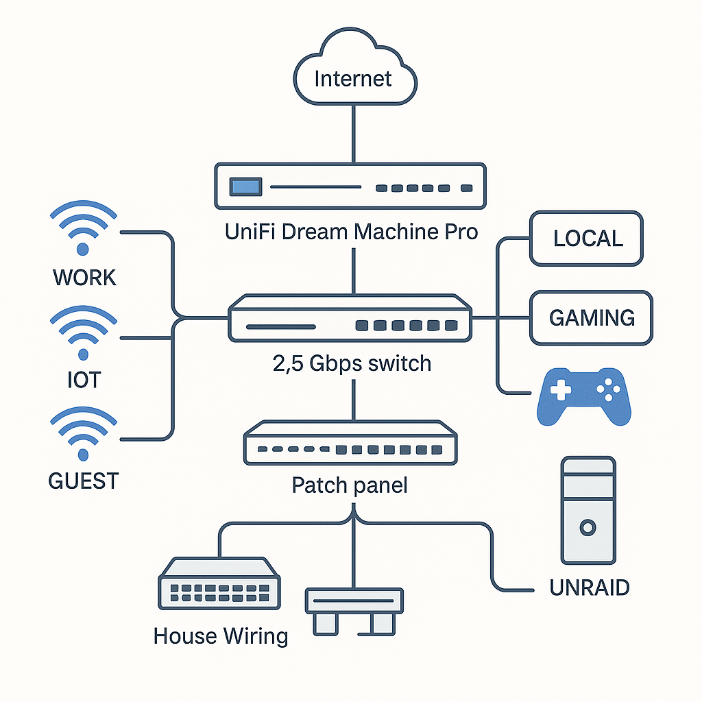
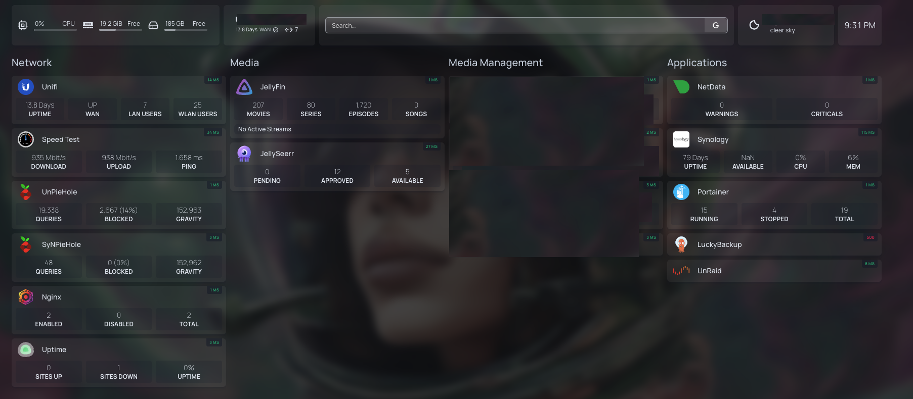
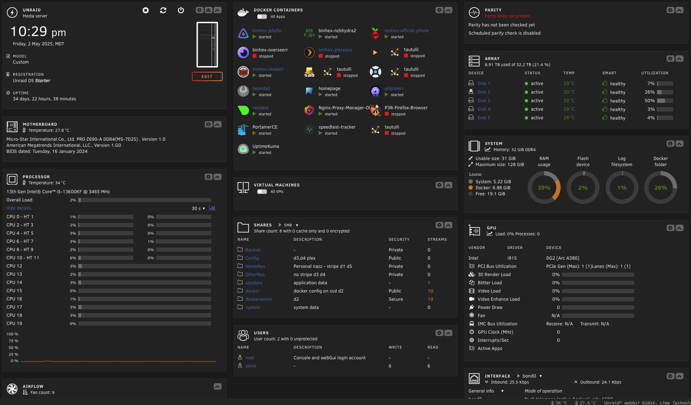

# 🏠 Home Lab 2025: Secure, Scalable Virtual Infrastructure

## 🎯 Goal / Why I Built This

I set out to build a home lab that could do double duty: act as a sandbox for experimenting with **virtualization, containers, automation, security**, and **cloud technologies**, while also serving as a centralized hub to manage all my media. My goal was to create a secure, scalable, and segmented infrastructure that feels like a scaled-down enterprise environment—where I can tinker, learn, and practice real-world skills like:

- Testing cloud deployments and DevOps pipelines
- Exploring identity and access management
- Implementing Zero Trust principles
- Automating deployments and network operations

## Technologies Used
- **Virtualization:** Proxmox, Unraid
- **Containerization:** Docker, Ansible
- **Networking:** Unifi, VLANs, Pi-hole
- **Storage:** Unraid NAS, Plex, Sonarr, Radarr
- **Security:** Pi-hole DNS filtering, Unifi firewall rules
- **Home Automation:** Home Assistant, wall-mounted tablets

## Architecture Overview
✅ **Virtualization Layer:** Started with Proxmox → migrated to Unraid for native Docker support and easier container management.  
✅ **Containerization & Automation:** Deployed applications using Docker; automated provisioning and updates using Ansible playbooks.  
✅ **Network Segmentation:** Created VLANs across Unifi switches to separate IoT, work, personal, and guest traffic for security and QoS.  
✅ **Security:** Installed redundant Pi-hole servers for DNS filtering and ad-blocking; configured firewall rules to limit east-west and outbound traffic.  
✅ **Storage & Media:** Built an Unraid-based NAS serving Plex, with automated downloads via arr's for media organization.  
✅ **Home Automation:** Configured Home Assistant; deployed wall-mounted tablets using Fully Kiosk Browser as centralized smart home control panels.

  

## Process
1. **Virtualization Platform** – Deployed Proxmox; migrated to Unraid for Docker container support and increased flexibility.
2. **Containerization & Automation** – Automated application deployments with Docker and Ansible to minimize manual maintenance.
3. **Network Security** – Installed redundant Pi-hole servers; configured Unifi firewall rules for DNS filtering and network protection.
4. **Network Segmentation** – Designed VLANs to isolate IoT, personal, work, and guest traffic to reduce risk and optimize performance.
5. **Storage & Media Management** – Built Unraid NAS to store backups and media; integrated Plex, Sonarr, and Radarr for automated library management.
6. **Home Automation** – Integrated Home Assistant; repurposed tablets into control hubs for centralized smart device management.

## Key Outcomes
✅ Built a **fully segmented, secure network** supporting enterprise-level security practices at home.  
✅ Automated **90% of deployment and updates** across apps and containers using Ansible.  
✅ Created a **centralized smart home platform** combining media management, automation, and secure networking.  
✅ Gained hands-on experience in **containerization, firewall management, ACLs, automated deployment of docker containers, and infrastructure as code.**

## Screenshots / Artifacts




## Generalized Deployment 
## 🚀 Ansible Deployment Playbook

This repository includes an Ansible playbook to automatically deploy the core containers in my Homelab 2025 setup. I've included both Jellyfin and Plex.

- Jellyfin
- NZBHydra
- Pi-hole
- Overseerr
- Plex
- Radarr
- Readarr
- SABnzbd
- Sonarr
- Heimdall
- Homepage
- Jellyseerr
- Nginx Proxy Manager
- Portainer CE

The playbook ensures all containers are deployed with recommended settings, using Docker on Unraid.

👉 **[View the Ansible Playbook](https://github.com/sgersz/homelab-2025/blob/main/docs/ansible_deploy.yml)**

## 🚀 Terraform Deployment Script

👉 **[View the Terraform Deployment Script](https://github.com/sgersz/homelab-2025/blob/main/docs/terraform_deploy.tf)**

I've included a general "how to deploy" below. Please keep in mind you will need to do some research to learn. The purpose of this is not to provide a copy paste, but outline the path I went down!

## 🛠️ Automating Unraid with Ansible 

This repository provides automation scripts for deploying Docker containers on **Unraid** using both **Ansible** and **Terraform**.

Although Unraid doesn't natively support Ansible or Terraform agents, you can manage containers remotely by connecting via **SSH** or accessing the Docker API from a control machine.

---

### 🚀 How to use with **Ansible**
1. Enable SSH access on Unraid (Settings → Management Access → Enable SSH).
2. Install Ansible:  
   [Ansible Installation Guide](https://docs.ansible.com/ansible/latest/installation_guide/intro_installation.html)
3. Create an inventory file:
   ```ini
   [unraid]
   192.168.x.x ansible_user=root ansible_ssh_pass=yourpassword
   run the playbook - ansible-playbook -i hosts deploy_containers.yml 

## 🚀 Using Terraform with Unraid

This repository includes a Terraform configuration (`main.tf`) to automatically deploy Docker containers on **Unraid** using the Docker provider.

While Unraid doesn’t natively support Terraform, you can run Terraform from a control machine (your local computer or another server) that can access the Docker daemon on Unraid.

### 📝 Steps to deploy:

1. ✅ **Install Terraform:**  
   [Terraform Installation Guide](https://developer.hashicorp.com/terraform/tutorials/aws-get-started/install-cli)

2. ✅ **Enable Docker access:**  
   - Run Terraform **locally on Unraid** by using the Docker socket `/var/run/docker.sock`  
   - Or **expose the Docker API via TCP** on Unraid (Settings → Docker → Enable remote API)

3. ✅ **Clone this repo:**
   ```bash
   git clone https://github.com/sgersz/homelab-2025.git
   cd homelab-2025/docs
   init - terraform init
   review - terraform plan
   apply - terraform apply

## Reflection / Learnings

Building a homelab sounded easy… until I actually started building one. 😅 It’s been equal parts rewarding, frustrating, eye-opening, and fun. I wanted a space that could do double duty: a **sandbox to tinker with virtualization, containers, automation, and security**, and a **central hub to finally get all my media organized** (because let’s be honest, it was chaos).

I was inspired by a really smart guy (you know who you are 👀) who suggested it’d be a great idea to **create something tangible that shows off technical skills**. Thanks for the kick in the butt—I probably needed it more than I realized!

This homelab isn’t just a static build; it’s a **living, evolving project**. The goal was never perfection—it was to learn, to break things (intentionally or not), and to build a space where I can test ideas, fail safely, and keep growing. And hey, if it ends up looking impressive along the way, that’s a bonus.

At the end of the day, this is about having fun, staying curious, and reminding myself that **learning never stops**.

## Key Skills Demonstrated
- Docker, Unraid, Ansible
- Network segmentation, VLANs, firewall config
- Pi-hole, Unifi
- Home Assistant, IoT security
- Automation, Infrastructure as Code
