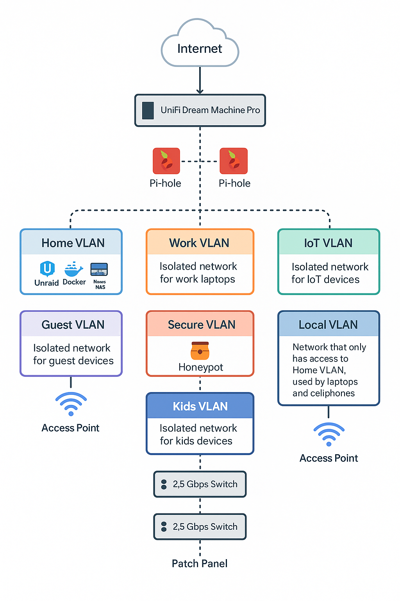

# 🏡 Homelab 2025 Project

Welcome to my Homelab 2025 project! This repo documents my journey in designing, deploying, and securing a fully-featured homelab environment—leveraging the same skills I use in enterprise cloud environments.

## 🔍 Goals
- Build a scalable, resilient lab environment to simulate production workloads
- Practice Infrastructure as Code (IaC) with Terraform and Ansible
- Automate deployments across Proxmox and AWS
- Secure services with best practices in IAM, firewalling, and segmentation
- Integrate identity management (Okta, Azure AD) for SSO in self-hosted apps
- Document architecture and automation to share with others

## 🏗️ Technologies Used
- Proxmox VE
- Terraform
- Ansible
- pfSense
- GitHub Actions
- Docker
- AWS EC2 / S3 (hybrid integration)
- Okta / Azure AD (SSO experiments)

## 🚀 Highlights
- ✅ Automated VM provisioning with Terraform + Proxmox API
- ✅ Centralized logging with Loki + Grafana
- ✅ Reverse proxy + HTTPS with Traefik
- ✅ SSO integration with Okta and self-hosted apps
- ✅ Zero-trust network design with VLANs + firewalling

## 📸 Architecture

## 📚 Documentation
Check `/docs` for detailed config notes and diagrams.

---

This repo will continue evolving as I iterate and expand the homelab. I’d love feedback or questions—feel free to open an issue!